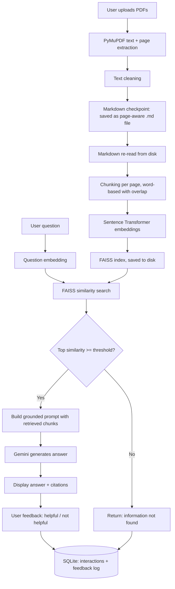

# Institutional PDF RAG Assistant

## Problem Statement

Students and staff often need to search through lengthy institutional PDF documents — academic regulations, syllabi, examination guidelines, student handbooks — to find small, specific pieces of information (e.g. "What is the minimum attendance requirement?"). Manually searching multi-page PDFs for this is slow and error-prone. This project builds a system that lets a user upload institutional PDFs and ask questions in natural language, receiving answers grounded in the actual document content along with source citations.

## Objectives

1. Extract and preserve text and page metadata from uploaded PDFs.
2. Split documents into retrievable chunks without losing source traceability.
3. Generate semantic embeddings for each chunk and index them for similarity search.
4. Retrieve the most relevant chunks for a user's question.
5. Generate an answer using an LLM, grounded strictly in retrieved content.
6. Provide document/page citations for every answer.
7. Detect and gracefully handle questions the documents cannot answer.
8. Collect user feedback and log low-confidence/unanswered questions for future evaluation.

This project deliberately does **not** implement any recommendation, prediction, or grading system — its scope is limited to retrieval-augmented question answering.

## Features

- PDF upload and text extraction with page-level metadata preserved
- Text cleaning (whitespace normalization, zero-width character removal)
- Word-based chunking with configurable size/overlap, chunked per-page to keep citations accurate
- Page-aware Markdown checkpoint written before chunking, so extracted text can be manually verified for accuracy prior to indexing
 - Sentence-embedding generation using `all-MiniLM-L6-v2`
- FAISS cosine-similarity vector index, persisted to disk and reloaded on restart
- Similarity-threshold-based low-confidence detection, in addition to LLM-level grounding refusal
- Gemini-based grounded answer generation with explicit instructions not to use outside knowledge
- Citation display (document name + page number + similarity score)
- 👍 / 👎 feedback capture
- SQLite logging of every interaction, including low-confidence and negatively-rated ones, for later evaluation

## Technology Stack

| Technology | Purpose |
|---|---|
| Python 3.12 | Core language |
| Flask | Lightweight web interface and routing |
| PyMuPDF (`fitz`) | PDF text and page extraction |
| Sentence Transformers (`all-MiniLM-L6-v2`) | Lightweight local embedding model, suitable for CPU-only execution |
| FAISS (`faiss-cpu`) | Fast vector similarity search |
| Gemini API (`google-genai`) | LLM used for grounded answer generation |
| SQLite | Feedback and low-confidence interaction logging |
| HTML/CSS/JS (via Flask templates) | Minimal frontend |

## Architecture


### Markdown Verification Checkpoint

Before chunking, extracted text is written to a page-aware Markdown file (`data/markdown/<filename>.md`), with page boundaries marked as `# Page N`. This file is a verbatim serialization of what PyMuPDF extracted — no cleanup, correction, or reformatting is applied — so extraction accuracy can be manually inspected before it reaches the rest of the pipeline. The chunker reads from this Markdown file rather than from the in-memory extraction output, making the `.md` file the actual source of truth for indexing, not just an export.

## Installation

Uses the existing `dsml312` conda environment.

```bash
conda activate dsml312
cd pdf_rag_assistant
pip install -r requirements.txt
```

Copy `.env.example` to `.env` and add your Gemini API key:

```
GEMINI_API_KEY=your_api_key_here
```

Run the application:

```bash
python app.py
```

Open `http://127.0.0.1:5000/` in a browser.

## Usage

1. **Upload PDF(s)** using the upload form. Multiple files can be selected at once.
2. Wait for the "documents processed successfully" confirmation, which reports the number of chunks indexed.
3. **Ask a question** about the uploaded documents in plain language.
4. **View the answer**, generated strictly from retrieved document content.
5. **View citations** — each answer lists the source PDF and page number(s) it was grounded in.
6. **Give feedback** using the 👍 / 👎 buttons; this is logged for later review.
7. Questions outside the scope of the uploaded documents are explicitly flagged as "not found" rather than answered speculatively.

## Evaluation

The system was evaluated against a 21-question test set spanning answerable-core, answerable-detail, unanswerable, and acronym-stress categories. Retrieval hit rate on answerable questions was 15/17 (88%). Confidence flagging was correct on 19/21 (90%) questions overall — the two exceptions were both single-acronym queries (RPC, ACID properties), consistent with the documented retrieval-sensitivity limitation of all-MiniLM-L6-v2 on short queries. All 4 unanswerable/out-of-domain questions were correctly identified as low-confidence, with no hallucinated answers observed. Average response time was 23.3s, though this includes occasional Gemini API retries during transient 503 errors.

## Limitations

- Tested against a small number of PDFs (1–5); has not been evaluated at larger document-collection scale.
- The similarity threshold for low-confidence detection is a heuristic default (0.35), not a rigorously tuned value — it acts as a practical safeguard, not a hallucination-prevention guarantee.
- Incremental indexing is filename-based: a PDF is only skipped if its exact filename was already indexed, so a renamed duplicate (or an unrelated file that happens to share a filename) is not detected as such.
- No authentication or multi-user support; designed for single-user local demonstration.
- Chunking is word-based and per-page; a fact split across a page boundary may occasionally be only partially retrieved.
- Embedding model runs locally and unauthenticated against Hugging Face Hub, which may hit rate limits under heavy use (non-blocking for this scale).

## Future Work

- Complete and document the formal evaluation (Phase 11).
- Tune the similarity threshold empirically using evaluation results.
- Consider incremental (non-rebuild) index updates if document volume grows.
- Add OCR support for scanned (non-text) PDFs.
- Investigate retrieval sensitivity to short/acronym-only queries (e.g. bare "RPC") versus full natural-language questions, as part of the formal evaluation.
- Expand the UI to show processing status per file and support document removal.